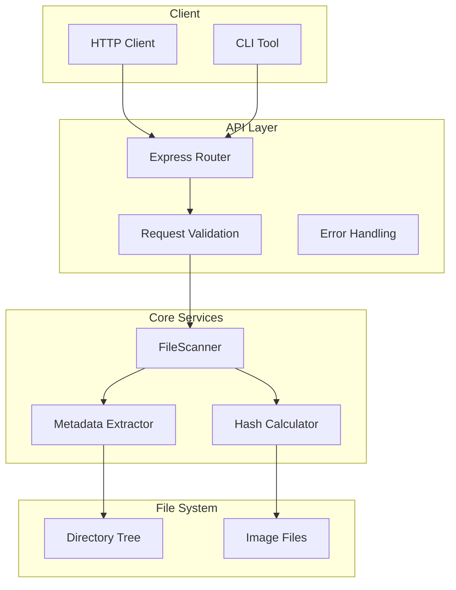
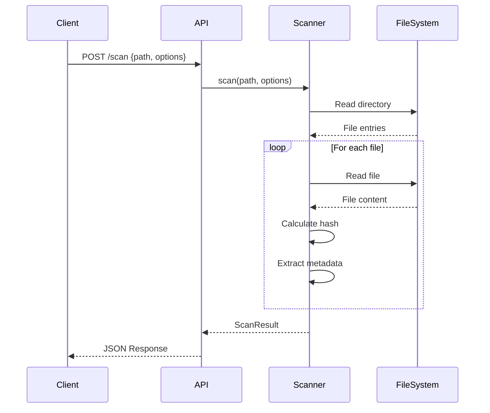
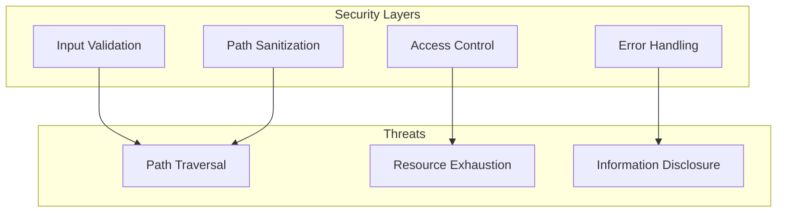

# Technical Architecture

## System Overview



## Component Architecture

### 1. API Layer

```typescript
interface APIArchitecture {
  router: {
    endpoints: ['POST /scan', 'POST /validate', 'GET /health'];
    middleware: ['JSON parsing', 'Error handling', 'Rate limiting'];
  };
  validation: {
    input: 'Request body validation';
    paths: 'Path accessibility checks';
    options: 'Scan options validation';
  };
  responses: {
    success: 'Standardized success responses';
    errors: 'Error response format';
    status: 'Appropriate HTTP status codes';
  };
}
```

### 2. Core Scanner Service

```typescript
interface ScannerArchitecture {
  components: {
    fileScanner: 'Directory traversal and file detection';
    metadataExtractor: 'Image metadata parsing';
    hashCalculator: 'File content hashing';
  };
  patterns: {
    strategy: 'Configurable scanning strategies';
    observer: 'Progress monitoring';
    factory: 'Scanner instance creation';
  };
  optimization: {
    streaming: 'Memory-efficient file reading';
    batching: 'Grouped file processing';
    caching: 'Result caching for performance';
  };
}
```

### 3. Type System

```typescript
interface TypeHierarchy {
  models: {
    ImageMetadata: 'Core image data structure';
    ScanOptions: 'Scanner configuration';
    ScanResult: 'Operation result format';
  };
  api: {
    Request: 'API request schemas';
    Response: 'API response formats';
    Error: 'Error response structure';
  };
  utils: {
    Hash: 'File hashing types';
    Progress: 'Progress tracking types';
  };
}
```

## Data Flow



## Key Design Decisions

### 1. Memory Management

```typescript
interface MemoryStrategy {
  streaming: {
    purpose: "Efficient file reading";
    implementation: "Node.js streams";
    chunkSize: "64KB default";
  };
  batching: {
    purpose: "Control memory pressure";
    implementation: "Async iteration";
    batchSize: "Configurable";
  };
}
```

### 2. Error Handling

```typescript
interface ErrorStrategy {
  layers: {
    api: "Request validation errors";
    scanner: "File system errors";
    utils: "Processing errors";
  };
  handling: {
    propagation: "Error bubbling with context";
    transformation: "Domain to API errors";
    logging: "Structured error logging";
  };
}
```

### 3. Performance Optimization

```typescript
interface PerformanceStrategy {
  concurrency: {
    fileReading: "Controlled parallel reads";
    hashing: "Worker pool for CPU work";
  };
  caching: {
    results: "Short-term scan results";
    metadata: "File metadata cache";
  };
  monitoring: {
    metrics: "Operation timing";
    resources: "Memory usage tracking";
  };
}
```

## Directory Structure

```
/src
│
├── api/                 # API layer
│   ├── index.ts        # Router setup
│   ├── middleware/     # Custom middleware
│   └── validation/     # Request validation
│
├── services/           # Core services
│   ├── scanner/        # File scanning
│   └── metadata/       # Metadata extraction
│
├── models/            # Type definitions
│   └── types.ts       # Core types
│
├── utils/             # Utilities
│   ├── hash.ts        # File hashing
│   └── validation.ts  # Path validation
│
└── index.ts          # Application entry
```

## Security Architecture



## Testing Strategy

```typescript
interface TestStrategy {
  unit: {
    scope: "Individual components";
    tools: ["Jest", "TypeScript"];
    coverage: "Min 80%";
  };
  integration: {
    scope: "Component interaction";
    approach: "API-driven testing";
  };
  performance: {
    scope: "Load and stress testing";
    metrics: ["Response time", "Memory usage"];
  };
}
```

## Monitoring and Logging

```typescript
interface ObservabilityStrategy {
  logging: {
    levels: ["error", "warn", "info", "debug"];
    context: "Operation-specific data";
    format: "Structured JSON";
  };
  metrics: {
    performance: ["Response time", "File count"];
    resources: ["Memory usage", "CPU load"];
    errors: ["Rate", "Types"];
  };
}
```

## Future Considerations

1. **Scalability**
   - Horizontal scaling with load balancing
   - Distributed scanning for large directories
   - Caching layer for frequent scans

2. **Features**
   - Image content analysis
   - Duplicate detection
   - Advanced metadata extraction
   - Real-time scan progress

3. **Integration**
   - Cloud storage providers
   - Image processing pipelines
   - Content management systems

## Development Workflow


## Support and Maintenance

1. **Issue Resolution**
   - Error tracking and alerts
   - Performance monitoring
   - User feedback system

2. **Updates**
   - Regular dependency updates
   - Security patches
   - Feature enhancements

3. **Documentation**
   - API versioning
   - Change logs
   - Migration guides
