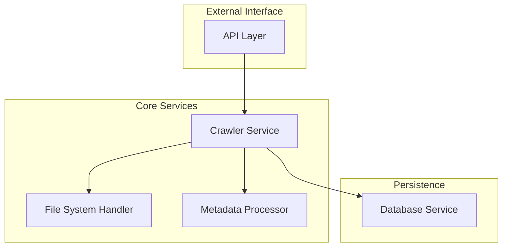
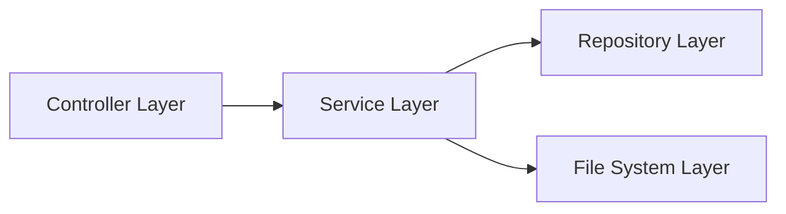
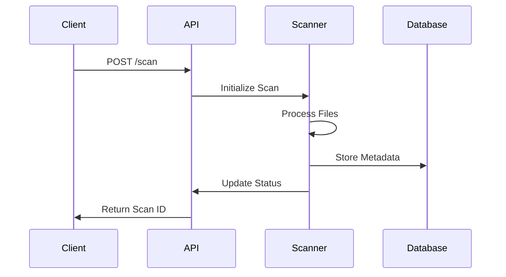
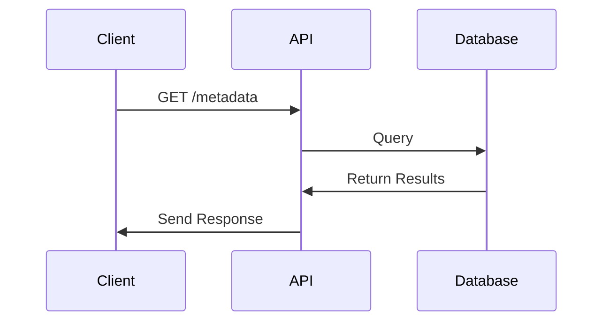
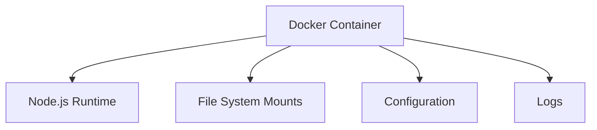

# System Patterns: Local Crawler Microservice

## Architecture Overview

### Core Components



## Design Patterns

### 1. Service Layer Pattern

- Clear separation between API endpoints and business logic
- Encapsulated crawler operations
- Standardized error handling and responses



### 2. Repository Pattern

- Abstracted database operations
- Centralized data access logic
- Consistent transaction handling

```typescript
interface MetadataRepository {
    save(metadata: FileMetadata): Promise<void>
    findByHash(hash: string): Promise<FileMetadata>
    updateStatus(id: string, status: FileStatus): Promise<void>
    // ... other methods
}
```

### 3. Strategy Pattern for File Processing

- Pluggable file type handlers
- Extensible metadata extraction

```typescript
interface FileProcessor {
    canProcess(file: File): boolean
    extractMetadata(file: File): Promise<Metadata>
}

class ImageProcessor implements FileProcessor {
    // Implementation for image files
}

class VideoProcessor implements FileProcessor {
    // Implementation for video files
}
```

### 4. Observer Pattern for Scan Events

- Asynchronous scan status updates
- Progress monitoring
- Error notification

```typescript
interface ScanObserver {
    onFileProcessed(file: File): void
    onError(error: Error): void
    onScanComplete(summary: ScanSummary): void
}
```

## Data Flow Patterns

### 1. File Scanning Flow



### 2. Metadata Query Flow



## Error Handling Patterns

### 1. Error Categories

- File System Errors
- Processing Errors
- Database Errors
- API Errors

### 2. Error Response Structure

```typescript
interface ErrorResponse {
    code: string
    message: string
    details?: Record<string, any>
    timestamp: string
}
```

## Configuration Patterns

### 1. Environment Variables

```typescript
interface Config {
    SCAN_DIRS: string[]
    FILE_TYPES: string[]
    MAX_FILE_SIZE: number
    DB_CONNECTION: string
    API_PORT: number
}
```

### 2. Dynamic Configuration

- Runtime configuration updates
- Per-scan configuration overrides
- Feature flags

## Testing Patterns

### 1. Unit Testing

- Service layer tests
- Repository tests
- File processor tests

### 2. Integration Testing

- API endpoint tests
- Database integration tests
- File system integration tests

### 3. End-to-End Testing

- Complete scan workflow tests
- Error handling scenarios
- Performance benchmarks

## Monitoring Patterns

### 1. Metrics Collection

- Scan duration
- Files processed
- Error rates
- API response times

### 2. Health Checks

- Database connectivity
- File system access
- Resource utilization
- Service status

## Security Patterns

### 1. Access Control

- API authentication
- Role-based permissions
- Rate limiting

### 2. Data Security

- Read-only file access
- Secure configuration
- Audit logging

## Deployment Patterns

### 1. Container Structure



### 2. Volume Mapping

- Read-only source directories
- Persistent storage for database
- Log volume for monitoring
